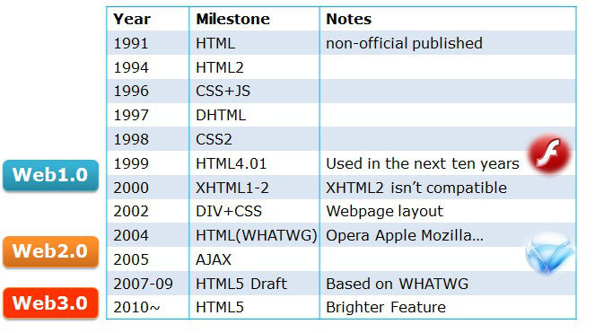

# 1. 服务器配置和开发工具
该部分内容介绍开发前需要了解的基本的技术知识、服务器环境的搭建、开发工具的选择等内容
## 1.1 upupw服务器环境配置
>**虚拟主机** 文件路径、域名（特殊域名，如：tp.io，需要设置hosts文件  
>**配置流程** 打开upupw程序界面，输入**11**后打开hosts配置工具，添加域名解析）、端口
## 1.2 开发工具
>**编辑器**：Visual Studio Code/Sublime Text  
>__浏览器__：Google Chrome/Firefox
## 1.3 网站开发基本技术
- 前端技术
	- HTML
	- CSS
	- JavaScript
- 服务器端
	- ASP/ASP.net
	- PHP
	- JSP(J2EE)
	- Python
	- Node.js(用JavaScript)
- 数据库
	- SQL语言
	- MSSQL
	- MySQL
- 面向对象
	- 基本概念，思想，抽象能力，逻辑思维
- 框架
	- Web基本原理、URL、HTTP、Socket、Ftp
	- MVC框架基本原理
	- MVVM框架
# 2. HTML语言
## 2.1 什么是HTML
*HTML*（Hyper Text Marup Language），超文本标记语言，是由[W3C][w3c]制定的一套标准，该标准来源于*SGML*，目前的最高版本是**HTML5**，主要的特点：
- 元素、标记、属性来控制内容
- 可以呈现多种类型的文档: 文本/图片/视频/声音等
- 具有超级链接，是一种超文本文件，一种特殊的文本文件（编码文件），扩展名".html"或".htm"

**备注：**
在创建HTML网页文件时要注意文件的编码格式，常见的编码格式:ASC/GB2312/GBK/Unicode/_**UTF-8**_(推荐)
## 2.2 HTML发展历史

## 2.3 HTML语法
- _双标记语法_
```
<tag property1="value1" prop2="value2 ...">要显示的内容</tag>

<tag>开始标记
</tag>闭合标记
```
- _单标记_
```
<tag property1="value1" prop2="value2 ...">
```
-_ 注释语句_
```
<!--Comments 注释内容-->
```
**备注：**
1. HTML中不区分大小写，但是[W3C][w3c]推荐全部使用小写，这也是一种规范
2. 大部分的标记都可以嵌套，但是要注意嵌套的顺序不要弄错
## 2.4 HTML文件基本结构
```
<!DOCTYPE html>                          文档声明
<html>                                   包裹网页所有内容最外层标签，第1层架构
    <head>                               告知浏览器信息的头部区域，第2层架构
        <title>Welcome to visit!</title> 文档标题，第3层
    </head>
    <body>                               用于显示内容的主体区域，第2层架构
        <p>Hello HTML!<br>               第3、4...n层内容区域
        这是我的第一个网页</p>
    </body>
</html>
```
## 2.5 HTML标记
- _文本说明修饰控制等_
	- **段落换行** <p align="left">This is a paragraph.<br>换行了</p>
	- **标题** <h1>header1</h1>...<h6>header6</h6>
	- **修饰/格式化** 有含义的 <strong>加强</strong> <em>强调</em> H<sub>2</sub>O EC<sup>2</sup>  
	<small>small text</small> <mark>Marked text</mark> <del>Delete</del> <ins>Ins</ins>  
	  无含义的 <b>Bold</b> <i>Italic</i> <u>Underline</u>
	- **水平线** <hr>
	- **预定义** <pre>预定义的内容   空格换行不会忽略</pre>
	- **引用** <blockquote cite="引用内容的出处">长内容引用中的<q>短内容引用</q>。</blockquote>
	- **地址** <address>家庭住址</address>
- _图片/音频/视频_
	- **图片**
	> &lt;img src="images/a.jpg" alt="风景"&gt;
	> 
	- **音频视频**
	```
	<audio src="abc.mp3" controls>你的浏览器不支持音频标记</audio>  
	<vedio src="abc.mp4" controls>你的浏览器不支持该视频标记</vedio>
	```
	<audio controls>
		<source src="abc.mp4">
	</audio>
- _列表_
	- **无序列表**
	```
	<ul type="disc/circle/square"><li>列表项</li></ul>
	```
	- **有序列表**
	```
	<ol type="1/a/A/i/I"><li>列表项</li></ol>
	```
	- **定义列表**
	```
	<dl><dt>标题</dt><dd>描述</dd></dl>
	```
- _超链接_
	- **定义超链接**
	```
	<a href="url">链接文字</a>
	url：可以是相对路径（包含相对文档和相对站点根目录两种），也可以是绝对路径
	```
	- **定义锚点**（书签）
	```
	<a name="锚点名称">[锚点]</a>
	<a href="url#锚点名称">链接文字</a>
	```
- _表格Table_
	- **标记**
	```
	表格<table></table> 行<tr></tr> 表头<th></th> 单元格<td></td> 表格标题<caption></caption>
	跨行单元格<td rowspan="行数"> 跨列单元格<td colspan="列数">
	```


<!-- 文中链接列表 -->
[w3c]: https://w3c.org "Web标准化组织"
<!-- [html]: https://www.w3c.org "HTML" -->